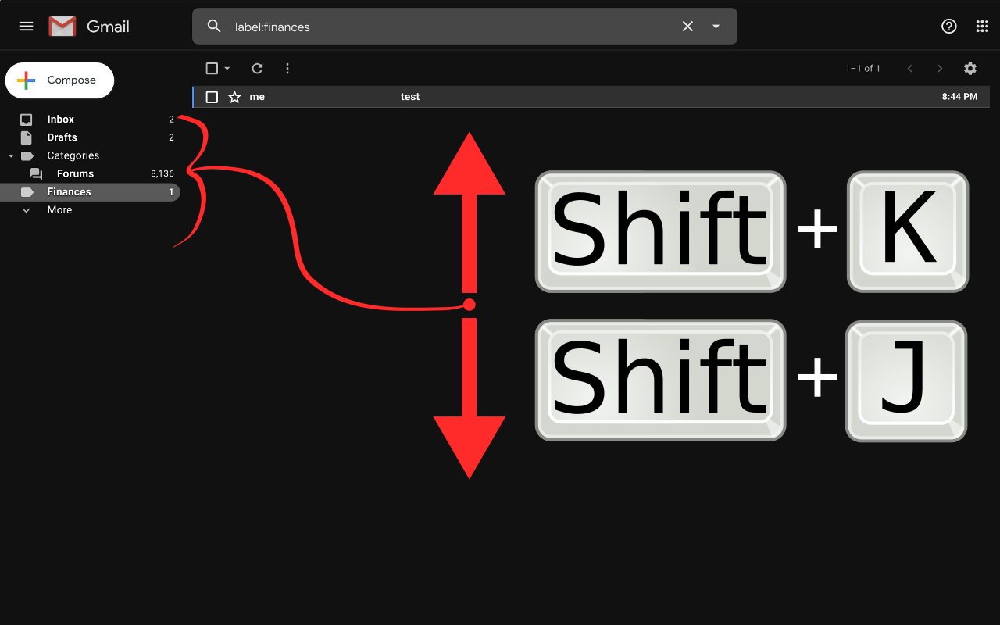

# GMail Label Switch Shortcuts

This is a simple browser extension which binds the keystroke `J`
(`shift` + `j`) or `K` (`shift` + `k`) to select the next or previous
label in GMail.

* [ Extension for Google Chrome
  ](https://chrome.google.com/webstore/detail/gmail-label-switch-shortcuts/dicajcdhaiakibijhofldipaiaiaiefj)

<!--
    
    
-->

* [ Extension for Mozilla Firefox
  ](https://addons.mozilla.org/en-US/firefox/addon/gmail-label-switch-shortcuts/)

<!--
    
    
-->

